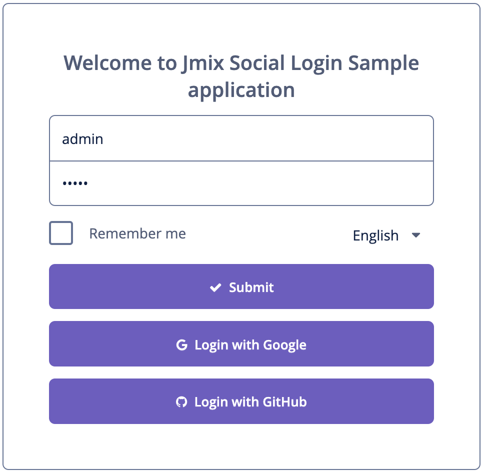

**ATTENTION: this repository is deprecated in favor of https://github.com/jmix-framework/jmix-samples**


# Jmix Social Login Sample

## Overview

The application demonstrates how to add social login buttons for multiple providers to the login screen.  Current example allows to login using Google or GitHub account.



The current sample doesn't use the [OIDC add-on](https://www.jmix.io/marketplace/openid-connect/). In most cases the OIDC connection tasks should be solved using this add-on.

When the user is authenticated using external provider the application checks whether the user entity instance linked with given Google or GitHub account already exists in Jmix database. If the user exists, it is loaded from the database and is set into security context. If not, then a new user is created in Jmix database and is linked with Google or GitHub account. 

## Main Classes and Files

[OAuthSecurityConfig.java](src/main/java/com/company/sample/OAuthSecurityConfig.java) is the Spring security configuration class. It configures authentication support using an OAuth 2.0 and OpenID Connect 1.0 Provider. Google uses OpenID Connect protocol and GitHub uses OAuth 2.0. 

```java
    @Override
    protected void configure(HttpSecurity http) throws Exception {
        http.apply(SecurityConfigurers.uiSecurity())
                .and()
                .oauth2Login(configurer -> {
                            configurer.userInfoEndpoint()
                                    .userService(oauth2UserService())
                                    .oidcUserService(oidcUserService())
                                    .and()
                                    .successHandler((request, response, authentication) -> {
                                        //redirect to the main screen after successful authentication using auth provider
                                        new DefaultRedirectStrategy().sendRedirect(request, response, "/#main");
                                    });
                        }
                )
                .logout(configurer -> {
                    configurer.logoutSuccessHandler(oidcLogoutSuccessHandler());
                });
    }
```

[User.java](src/main/java/com/company/sample/entity/User.java) additionally implements the `org.springframework.security.oauth2.core.oidc.user.OidcUser` interface.

[LoginScreen.java](src/main/java/com/company/sample/screen/login/LoginScreen.java) contains login button handlers:

```java
    @Subscribe("loginGoogle")
    public void onLoginGoogle(Action.ActionPerformedEvent event) {
        Map<String, Object> params = new HashMap<>();
        params.put("target", "_self");
        webBrowserTools.showWebPage("/oauth2/authorization/google", params);
    }

    @Subscribe("loginGitHub")
    public void onLoginGitHub(Action.ActionPerformedEvent event) {
        Map<String, Object> params = new HashMap<>();
        params.put("target", "_self");
        webBrowserTools.showWebPage("/oauth2/authorization/github", params);
    }
```

[application.properties](src/main/resources/application.properties) must contain your Google and GitHub applications client id and client secret.

```properties
spring.security.oauth2.client.registration.google.client-id=<your-google-client-id>
spring.security.oauth2.client.registration.google.client-secret=<your-google-client-secret>

spring.security.oauth2.client.registration.github.client-id=<your-github-client-id>
spring.security.oauth2.client.registration.github.client-secret=<your-github-client-secret>
```
